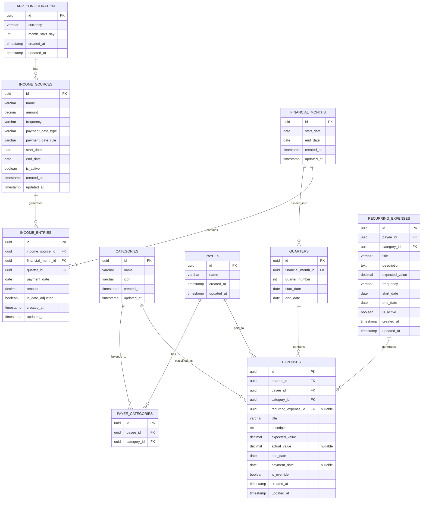

# Data Models

## Entity Relationship Diagram

---

## Table Definitions

### app_configuration

Stores the application setup (FR-1 to FR-3). Single row.

| Column | Type | Constraints | Description |
|--------|------|-------------|-------------|
| id | UUID | PK | Primary key |
| currency | VARCHAR(3) | NOT NULL | ISO 4217 currency code (e.g., EUR, GBP) |
| month_start_day | INT | NOT NULL, DEFAULT 1 | Day of month finances start (1-28) |
| created_at | TIMESTAMP | NOT NULL | Record creation time |
| updated_at | TIMESTAMP | NOT NULL | Last update time |

**Constraints:**
- `chk_app_configuration_start_day`: `month_start_day BETWEEN 1 AND 28`

**Traces:** FR-1, FR-2, FR-3

---

### income_sources

Recurring income definitions (FR-4).

| Column | Type | Constraints | Description |
|--------|------|-------------|-------------|
| id | UUID | PK | Primary key |
| name | VARCHAR(255) | NOT NULL | Income source name (e.g., "Salary", "Freelance") |
| amount | DECIMAL(12,2) | NOT NULL | Payment amount |
| frequency | VARCHAR(20) | NOT NULL | `monthly`, `weekly`, `fortnightly`, `four_weekly` |
| payment_date_type | VARCHAR(10) | NOT NULL | `fixed` or `relative` |
| payment_date_rule | VARCHAR(100) | NOT NULL | Rule definition (e.g., "25" for fixed, "last_thursday" for relative) |
| start_date | DATE | NOT NULL | When this income source starts |
| end_date | DATE | NULL | When it ends (null = indefinite) |
| is_active | BOOLEAN | NOT NULL, DEFAULT TRUE | Soft deactivation |
| created_at | TIMESTAMP | NOT NULL | Record creation time |
| updated_at | TIMESTAMP | NOT NULL | Last update time |

**Constraints:**
- `chk_income_sources_positive_amount`: `amount > 0`
- `chk_income_sources_frequency`: `frequency IN ('monthly', 'weekly', 'fortnightly', 'four_weekly')`
- `chk_income_sources_date_type`: `payment_date_type IN ('fixed', 'relative')`

**Traces:** FR-4

---

### income_entries

Materialized income for a specific month (FR-17).

| Column | Type | Constraints | Description |
|--------|------|-------------|-------------|
| id | UUID | PK | Primary key |
| income_source_id | UUID | FK, NOT NULL | References income_sources |
| financial_month_id | UUID | FK, NOT NULL | References financial_months |
| quarter_id | UUID | FK, NOT NULL | Which quarter this falls into |
| payment_date | DATE | NOT NULL | Calculated or adjusted payment date |
| amount | DECIMAL(12,2) | NOT NULL | Amount for this entry |
| is_date_adjusted | BOOLEAN | NOT NULL, DEFAULT FALSE | Whether user adjusted the date |
| created_at | TIMESTAMP | NOT NULL | Record creation time |
| updated_at | TIMESTAMP | NOT NULL | Last update time |

**Constraints:**
- `chk_income_entries_positive_amount`: `amount > 0`

**Traces:** FR-4, FR-17

---

### categories

Expense categories with icons (FR-5).

| Column | Type | Constraints | Description |
|--------|------|-------------|-------------|
| id | UUID | PK | Primary key |
| name | VARCHAR(100) | NOT NULL, UNIQUE | Category name |
| icon | VARCHAR(100) | NOT NULL | Tabler icon identifier (e.g., "shopping-cart") |
| created_at | TIMESTAMP | NOT NULL | Record creation time |
| updated_at | TIMESTAMP | NOT NULL | Last update time |

**Traces:** FR-5, ADR-8

---

### payees

Entities to whom expenses are paid (FR-6).

| Column | Type | Constraints | Description |
|--------|------|-------------|-------------|
| id | UUID | PK | Primary key |
| name | VARCHAR(255) | NOT NULL, UNIQUE | Payee name |
| created_at | TIMESTAMP | NOT NULL | Record creation time |
| updated_at | TIMESTAMP | NOT NULL | Last update time |

**Traces:** FR-6

---

### payee_categories

Many-to-many relationship between payees and categories (FR-7).

| Column | Type | Constraints | Description |
|--------|------|-------------|-------------|
| id | UUID | PK | Primary key |
| payee_id | UUID | FK, NOT NULL | References payees |
| category_id | UUID | FK, NOT NULL | References categories |

**Constraints:**
- `uq_payee_categories_payee_category`: unique on `(payee_id, category_id)`

**Traces:** FR-7

---

### financial_months

A financial month period (FR-8).

| Column | Type | Constraints | Description |
|--------|------|-------------|-------------|
| id | UUID | PK | Primary key |
| start_date | DATE | NOT NULL, UNIQUE | Month start (based on configured start day) |
| end_date | DATE | NOT NULL | Month end (day before next month's start) |
| created_at | TIMESTAMP | NOT NULL | Record creation time |
| updated_at | TIMESTAMP | NOT NULL | Last update time |

**Constraints:**
- `chk_financial_months_dates`: `end_date > start_date`
- `uq_financial_months_start_date`: unique on `start_date`

**Traces:** FR-8

---

### quarters

One of 4 periods within a financial month (FR-9).

| Column | Type | Constraints | Description |
|--------|------|-------------|-------------|
| id | UUID | PK | Primary key |
| financial_month_id | UUID | FK, NOT NULL | References financial_months |
| quarter_number | INT | NOT NULL | 1, 2, 3, or 4 |
| start_date | DATE | NOT NULL | Quarter start date |
| end_date | DATE | NOT NULL | Quarter end date |

**Constraints:**
- `chk_quarters_number`: `quarter_number BETWEEN 1 AND 4`
- `chk_quarters_dates`: `end_date > start_date`
- `uq_quarters_month_number`: unique on `(financial_month_id, quarter_number)`

**Traces:** FR-9

---

### recurring_expenses

Templates for expenses that repeat across months (FR-10).

| Column | Type | Constraints | Description |
|--------|------|-------------|-------------|
| id | UUID | PK | Primary key |
| payee_id | UUID | FK, NOT NULL | References payees |
| category_id | UUID | FK, NOT NULL | References categories |
| title | VARCHAR(255) | NOT NULL | Expense title |
| description | TEXT | NULL | Optional description |
| expected_value | DECIMAL(12,2) | NOT NULL | Default expected amount |
| frequency | VARCHAR(20) | NOT NULL | `monthly`, `weekly`, `fortnightly`, `four_weekly` |
| start_date | DATE | NOT NULL | When recurrence begins |
| end_date | DATE | NULL | When recurrence ends (null = indefinite) |
| is_active | BOOLEAN | NOT NULL, DEFAULT TRUE | Soft deactivation |
| created_at | TIMESTAMP | NOT NULL | Record creation time |
| updated_at | TIMESTAMP | NOT NULL | Last update time |

**Constraints:**
- `chk_recurring_expenses_positive_value`: `expected_value > 0`
- `chk_recurring_expenses_frequency`: `frequency IN ('monthly', 'weekly', 'fortnightly', 'four_weekly')`

**Traces:** FR-10, FR-21

---

### expenses

Individual expense entries — both planned and actual (FR-10, FR-12).

| Column | Type | Constraints | Description |
|--------|------|-------------|-------------|
| id | UUID | PK | Primary key |
| quarter_id | UUID | FK, NOT NULL | References quarters |
| payee_id | UUID | FK, NOT NULL | References payees |
| category_id | UUID | FK, NOT NULL | References categories |
| recurring_expense_id | UUID | FK, NULL | References recurring_expenses (if generated from one) |
| title | VARCHAR(255) | NOT NULL | Expense title |
| description | TEXT | NULL | Optional description |
| expected_value | DECIMAL(12,2) | NOT NULL | Planned amount |
| actual_value | DECIMAL(12,2) | NULL | Actual paid amount (null = not yet paid) |
| due_date | DATE | NOT NULL | When payment is due |
| payment_date | DATE | NULL | When payment was made (null = not yet paid) |
| is_override | BOOLEAN | NOT NULL, DEFAULT FALSE | Whether this overrides a recurring expense's defaults |
| created_at | TIMESTAMP | NOT NULL | Record creation time |
| updated_at | TIMESTAMP | NOT NULL | Last update time |

**Constraints:**
- `chk_expenses_non_negative_expected`: `expected_value >= 0`
- `chk_expenses_positive_actual`: `actual_value IS NULL OR actual_value > 0`

**Derived status (FR-18):**
- **Paid:** `payment_date IS NOT NULL AND actual_value IS NOT NULL`
- **Overdue:** `due_date < CURRENT_DATE AND payment_date IS NULL`
- **Pending:** `due_date >= CURRENT_DATE AND payment_date IS NULL`

**Traces:** FR-10, FR-11, FR-12, FR-13, FR-18, FR-21

---

## Indexes

| Index | Table | Columns | Rationale |
|-------|-------|---------|-----------|
| `idx_expenses_quarter_id` | expenses | quarter_id | Query expenses by quarter |
| `idx_expenses_due_date` | expenses | due_date | Status derivation, ordering |
| `idx_expenses_payee_id` | expenses | payee_id | Filter by payee |
| `idx_expenses_category_id` | expenses | category_id | Category breakdown reports |
| `idx_expenses_recurring_id` | expenses | recurring_expense_id | Find generated entries |
| `idx_income_entries_month_id` | income_entries | financial_month_id | Query income by month |
| `idx_quarters_month_id` | quarters | financial_month_id | Query quarters by month |

---

## Notes

- All IDs are **UUIDv7** (time-ordered, RFC 9562) — sequential insert performance with UUID benefits
- All `id` columns have `DEFAULT uuidv7()` — application generates IDs in Kotlin, DB provides fallback for manual inserts/migrations
- PostgreSQL 17 (latest LTS) — native `uuidv7()` function support
- All tables have `created_at` and `updated_at` audit columns
- `DECIMAL(12,2)` supports values up to 9,999,999,999.99
- Status is derived, not stored — avoids stale data
- `is_override` on expenses marks when a recurring expense was modified for a specific month (FR-21)
