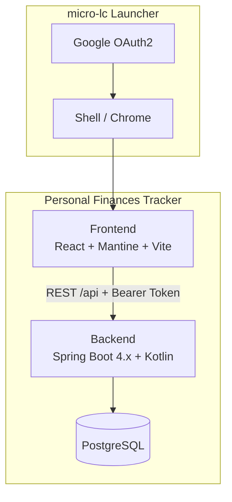
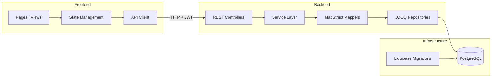

# Design Index

## Architecture Overview

Personal Finances Tracker is a micro-frontend application composed of a Kotlin/Spring Boot backend API and a React/Mantine frontend, designed to be loaded by a micro-lc launcher.

## Pages

| Page | Description |
|------|-------------|
| [adrs.md](adrs.md) | Architecture Decision Records |
| [data-models.md](data-models.md) | Database schemas and entity relationships |
| [rest-architecture.md](rest-architecture.md) | REST API design and endpoints |
| [frontend-architecture.md](frontend-architecture.md) | Frontend structure, routing, and component design |
| [ui-testing.md](ui-testing.md) | UI testing guidelines and strategy |
| [test-scenarios.md](test-scenarios.md) | Test scenarios validating requirements |

## Component Interaction

## Key Design Decisions

| ADR                                                               | Decision                                   | Status   |
|-------------------------------------------------------------------|--------------------------------------------|----------|
| [ADR-1](adrs.md#adr-1-multi-module-gradle-build)                  | Multi-module Gradle build                  | Accepted |
| [ADR-2](adrs.md#adr-2-spring-boot-4x-with-kotlin)                 | Spring Boot 4.x with Kotlin                | Accepted |
| [ADR-3](adrs.md#adr-3-react--mantine--vite-for-frontend)          | React + Mantine + Vite for frontend        | Accepted |
| [ADR-4](adrs.md#adr-4-oauth2-with-dev-fake-identity)              | OAuth2 with dev fake identity              | Accepted |
| [ADR-5](adrs.md#adr-5-postgresql-with-docker-compose)             | PostgreSQL with Docker Compose             | Accepted |
| [ADR-6](adrs.md#adr-6-liquibase--jooq-for-data-layer)             | Liquibase + JOOQ for data layer            | Accepted |
| [ADR-7](adrs.md#adr-7-micro-frontend-composition-via-micro-lc)    | Micro-frontend composition via micro-lc    | Accepted |
| [ADR-8](adrs.md#adr-8-tabler-icons-for-category-visuals)          | Tabler Icons for category visuals          | Accepted |
| [ADR-9](adrs.md#adr-9-github-actions-for-cicd)                    | GitHub Actions for CI/CD                   | Accepted |
| [ADR-10](adrs.md#adr-10-kapt-for-annotation-processing-mapstruct) | kapt for annotation processing (MapStruct) | Accepted |
| [ADR-11](adrs.md#adr-11-uuidv7-for-primary-keys)                  | UUIDv7 for primary keys                    | Accepted |
